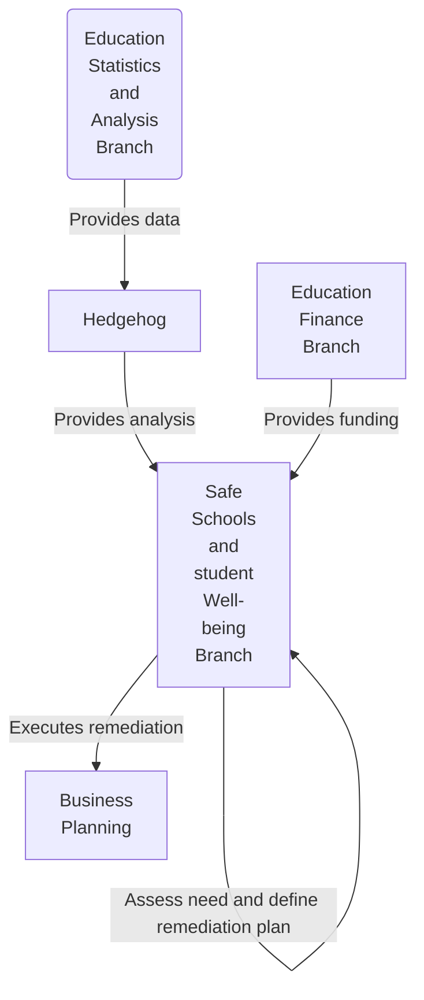
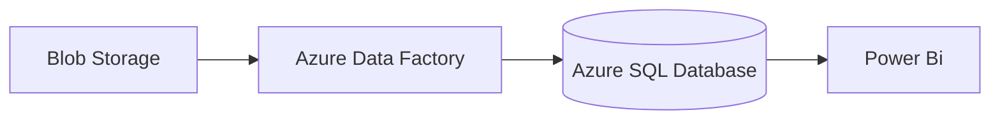
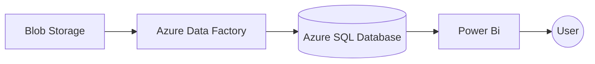
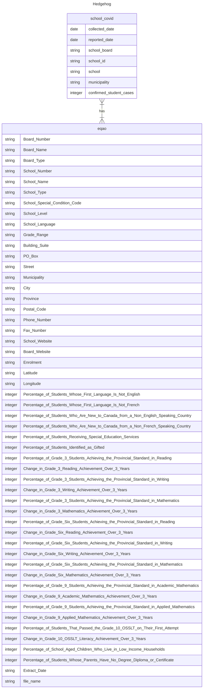

# Introduction

## Overview

Hedgehog is an application created to explore the relationship between COVID and the
academic performance in the Ontario school system.

## Problem Statement

Determine whether the COVID-19 pandemic impacted academic performance at the elementary and high school level in Ontario. Identify geographical areas that may serve as physical placements for the distribution of aid.

## Assumptions and Constraints

### Assumptions
- Data point and data sources are sufficiently reliable to address the problem statement
- Assume upstream systems/partners are providing data in expected formats

### Constraints

#### Vendor
This project makes heavy use of Azure Cloud Computing Services. This may limit this project in terms of available configurations, as well as making migrating to a new cloud platform more difficult if the need arises.

#### Cost
The budget for this project is limited, so it makes use of as much free services offered by Azure as possible. This limits access to the reporting dashboards as the free Power BI tier is used. Lower cost tiers may not perform as expected under load.

#### Data Sources
This project relies on publicly available datasets. These datasets limits the project to the years 2017-2021 as the Ontario government has only publicly released EQAO data for those years.

## Requirements

### Functional Requirements

- Does COVID materially impact academic performance at the following levels
	 - Academic Level (Grade 3, 6, 9, 10)
	 - Reading, Writing, Math
 - Identify geographic area's whose schools were most affected by Covid-19
### Non-Functional Requirements

- New data arrives on an annual basis on July 1
- The processing time to load and make data available for analysis must be
no longer than one hour
- The application must be able to handle 4 years of data plus 3 additional
years where the data grows 20% per year.
- The application must be able to provide geographic redundancy
- Minimum RTO 24 hours at the reporting data store
- Minimum RPO 1 hour at the reporting data store
- Reporting capability must be available 99.9% of the time
- Data must be encrypted end-to-end in-transit and at rest
- The application must be scalable in terms of processing power and data
storage.
- The solution must provide daily metrics. For example, records processed,
records not processed, elapsed execution time

## Results

Using the Power BI visualization, it is observed using EQAO testing, student performance dropped 1-5% of in the 2019-2020 academic year compared to the previous year.  EQAO data before the 2017-2018 academic year is not available so it is not possible to determine if this is a concern or within a normal range.

|Figure 1 Students achieving provincial standard on EQAO assessments 

In the 2019-2020 academic year, the EQAO cancelled all remaining EQAO assessments. What EQAO tests took place, happened before the March 2020 Covid-19 lockdowns and subsequent online learning. Covid-19 and it's aftermath may not have had much of an effect on EQAO results.

With the drop within the 2019-2020 academic year, 2020-2021 the academic year saw a rebound in test results in the 2020-2021 academic year.

A heat map proves useful to determine that Covid-19 affected schools in metropolitan areas much more than schools in more rural areas. This is likely due to the increased population of students in each school as well as more dense population centers in urban environments.

In future pandemic scenarios, the government and school boards may want to allocate more resources in these areas in order to protect students and to help limit the effects of a pandemic on academic performance.

|Figure 2: Covid-19 impact on Ontario schools

## Design

### Business Context

This section describes the role Hedgehog plays within the context of the holistic business process.

[Ontario Ministry of Education Organizational Chart](https://ncee.org/wp-content/uploads/2016/12/Ont-extra-non-AV-1-Ontario-Ministry-of-Education-2015-Organization-Chart.pdf)
### High-Level View

This section provides a high level summary view of the components employed by Hedgehog and its sequential flow.

| Component          | Responsibility                                                                                 |
| ------------------ | ---------------------------------------------------------------------------------------------- |
| Blob Storage       | Store raw data files                                                                           |
| Azure Data Factory | Data Ingestion   Data Cleansing   Data merging   Data transformation   Data export |
| Azure SQL Database | Store data in a relational format                                                              |
| Power BI           | Reporting and Analytics                                                                        | 

### Design Rationale

#### Blob Storage
Azure blob storage is specifically designed for this use case, storing relatively few files for analysis using azure resources. [^1]. The files only need to be processed a few times annually, allowing the files to be stored in the cold storage tier, which is cheaper.

#### Azure Data Factory
Azure Data Factory is a cost-effective cloud-based ETL service designed to clean, transform, and transfer data. This project requires data to be read from Excel files, cleaned, transformed, and loaded into a database for future analysis. The perfect use-case for this service.

##### Azure SQL Database
The datasets have relational characteristics, making a relational database optimal for long-term storage. This project doesn't require the features and performance of other Azure database services, making the serverless Azure SQL Database tier a cost-effective choice for this project.

#### Power BI
Power BI is a powerful, industry-standard tool used for data visualization and analysis. It easily integrates with other Azure Services and has a free tier.

#### Other considerations
##### Azure Data Lake
Deemed too excessive for the volume and frequency of data used for this analysis. Azure Blob storage better matched this use-case.

##### Preprocessing using python
A python script was considered to preprocess data. However, it was found not to be easily repeatable, and Azure Data Factory better matched this use-case.
##### Doing analysis using Juypter Notebook
Juypter Notebooks were considered to complete the analysis and visualizations instead of Power BI.  
	- Advantages
		- Very granular level of control and configuration over every aspect.
		- Able to easily be deployed locally or at various different cloud providers
	- Disadvantages
		- Doesn't offer out-of-the-box features, for relatively simple analysis
		- Larger effort required.
[^1]:https://learn.microsoft.com/en-us/azure/storage/blobs/storage-blobs-introduction#about-blob-storage
### Detailed View

This section provides a detailed level summary view of the components employed by Hedgehog and its sequential flow.

#### Blob Storage
A storage account was created to store EQAO and Ontario Covid-19 data. The development environment employed a hot storage tier to support frequent file access needs. In production, the data needs to be access infrequently allowing the more cost-effective cold storage tier to be used.
#### Azure Data Factory
Azure Data Factory has the following workflow
- Datasets
	- 2 sources
		- EQAO Excel files
		- Ontario Covid CSV files
	- 2 Sinks
		- EQAO table
		- Covid table
- Data flow
	- EQAO
		- Data Source
			- Reads all excel files in storage account
		- Clean
			- Cleans data
				- Removes percentage signs characters from numeric columns
				- Nullify NA values in data
		- Transform
			- Transform the file name to year column
		- Sink
			- Recreates table on run
				- If file is updated by adding or removing rows new table will reflect that 
	- Covid
		- Source
			- Reads specific csv file
		- Clean
			- No cleaning required
		- Transformation
			- No transformations required
		- Sink
			- Recreates table on run
				- If file is updated by adding or removing rows new table will reflect that 
- Pipeline
	- Runs both data flows
#### Azure SQL Database
The database stores two tables, each containing EQAO and Covid-19 data respectively. This project makes use of the server-less SQL database tier enabling it to automatically scale up and down based on usage, as well as automatically pause when the database is infrequently queried to save costs. These features make the database a performant and cost-effective service.
#### Power BI
Power BI is a tool that easily integrates with Azure SQL services. It was used for exploratory data analysis and to showcase the data to end users. 

##### Data Cleaning Rules
Data cleaning rules were used to remove percentage characters from columns meant to be integers

##### Data Transformation Rules
A data transformation rule was used to transform the file name to a date containing the year of the testing.
A data transformation rule was used to transform NA (not applicable), N/D (no data), N/R (not reported) to null values.
### Security

Azure’s inherent robust security ensures that data is secured both at rest and in-transit.

#### At Rest
Azure Data Factory (inclusive of Integration Runtime) does not persist any
temporary data, cached data or logs. Credentials used by linked services use
certificates to encrypt at rest.

Azure Blob Storage is supported by Storage Service Encryption (SSE) to
automatically encrypt data prior to persistence and similarly decrypts on access.[^2]

Azure SQL Database supports transparent data encryption (TDE) to
automatically encrypt/decrypt data.[^3]

#### In-Transit
This design uses an Azure IR, rather than a self-hosted IR, which eliminates the
need to manage data security outside of Azure. No on-premise resources are used
and therefore no transport security is required to be implemented as part of the
application.

Data passed between Blob storage, ADF and Azure SQL is encrypted in transit
using certificates managed by Azure and changed regularly.

Importing data to Azure blob storage is done utilizing HTTPS/TLS.[^4]

[^2]:https://learn.microsoft.com/en-us/azure/storage/common/storage-service-encryption
[^3]:https://learn.microsoft.com/en-us/azure/azure-sql/database/transparent-data-encryption-tde-overview?view=azuresql&amp;tabs=azure-portal
[^4]:https://learn.microsoft.com/en-us/azure/data-factory/data-movement-security-considerations

### Data Sources

The data was obtained from the following sources

[EQAO Data](https://data.ontario.ca/dataset/school-information-and-student-demographics)

[COVID Data](https://data.ontario.ca/dataset/summary-of-cases-in-schools/resource/8b6d22e2-7065-4b0f-966f-02640be366f2)
### Data Characteristics

| Characteristics  | Definition                                            | EQAO Metrics                                                                                                                                                                                                                                                                                                                                                                                                                                                           | COVID Metrics                                                                                                                                                                                                                                 |
| ---------------- | ----------------------------------------------------- | ---------------------------------------------------------------------------------------------------------------------------------------------------------------------------------------------------------------------------------------------------------------------------------------------------------------------------------------------------------------------------------------------------------------------------------------------------------------------- | --------------------------------------------------------------------------------------------------------------------------------------------------------------------------------------------------------------------------------------------- |
| Accuracy         | Conformity to the truth                               | The Ontario government manages the collection and governance of the data and is therefore deemed to be a trustworthy source responsible for the accuracy.                                                                                                                                                                                                                                                                                                              | The Ontario Provincial government compelled school boards to acquire and report data. Schools obtained the data from self-reported absences of students and staff. The data may not reflect the true number of COVID-19 cases within a school |
| Completeness     | All required data points are present                  | All students in grades 3, 6, 9 and 10 are required to take their respective tests. Schools that do not have particular grades are not required to submitted data for their grades. Some schools have the number of students participating less than 10, for the purposes of anonymization results are not reported.[^5] Given that more than 600 000 students across the province complete EQAO annually, these instances are not considered statistically significant | The Ontario Provincial government compelled school boards to acquire and report data. The data is deemed to be completed under the governance of the Ontario Provincial government.                                                           |
| Consistency      | Data points have consistent meaning across datasets   | Each dataset contains the same reporting features.                                                                                                                                                                                                                                                                                                                                                                                                                     | With only one dataset the data is intrinsically consistent.                                                                                                                                                                                   |
| Cohesion         | Able to be related to other relevant datasets         | The datasets contains the School Board Name, School ID, School Name, and reported date.                                                                                                                                                                                                                                                                                                                                                                                | The datasets contains the School Board Name, School ID, School Name, and reported date.                                                                                                                                                       |
| Timeliness       | Possess an acceptable currency                        | The EQAO data only applicable to COVID-19 is the dataset from September 1, 2020 - June 30, 2021. The EQAO announced on 18/03/2020 that all EQAO assessments for the 2019-2020 school year were cancelled. However the province did release a dataset for that academic year.[^6]                                                                                                                                                                                       | School boards were compelled to report COVID-19 cases between the dates September 11th, 2020 - April 27, 2021. The dataset cannot be used for EQAO data before or after these dates.                                                          |
| Data Definitions | Data points meanings are understood and/or documented | All the data points are self-explanatory, ex. "Percentage of Student who Achieve Provincial Standard"                                                                                                                                                                                                                                                                                                                                                                  | The dataset is well documented at the source.                                                                                                                                                                                                 |
| Relevance        | Pertinence of the data relative to utility            | EQAO data reporting the performance of students is necessary for analysis on the topic. This data is deemed relevant to the project.                                                                                                                                                                                                                                                                                                                                   | COVID-19 data may be used to see if cases had an impact on student performance. This data is deemed relevant to the analysis.                                                                                                                 |
| Reliability      | Data source trustworthiness                           | The Ontario government manages the collection and governance of the data and is therefore deemed to be a trustworthy source responsible for the accuracy.                                                                                                                                                                                                                                                                                                              | The Ontario Provincial government compelled school boards to acquire and report data. Schools obtained the data from self-reported absences of students and staff. The data may not reflect the true number of COVID-19 cases within a school | 

[^5]:https://www.app.edu.gov.on.ca/eng/sift/glossary.asp
[^6]:https://www.eqao.com/2019-2020-assessment-cancellation/
### Data Flow

### Data Design View

### Performance and Scalability Strategy

Azure Data Factory (ADF) is inherently performant because ADF pipelines are platformed on a serverless architecture that supports parallelism at different levels. ADF pipelines are able to take full advantage of network bandwidth between source and destination data sources. In addition data sources offer good input/output operations per second (IOPS).

The current design calls for the input and output data stores would not be on-premise. Since the data stores reside in Azure, and the Azure Integration Runtime (IR) is not self-hosted, the architecture takes full advantage of Azure performance capabilities. The potential impact of poor non-premise resources do not pose a risk since no non-premise resources are employed. At 50 Mbps (low end range) the estimated time to move data for 1 GB of data is expected to 2.7mins[^5]. The input data sources consume .0006 GB. Therefore even at the most conservative bandwidth the processing time objective would be met at 3,333x growth. It is very unlikely that the application would need to exercise performance tuning measures.

The following measures are available in the unlikely event that performance needs to be remediated.
1. For Each Loops can be used to execute copy activities in parallel. [^7]
2. The number of Data Integration Units (DIUs) cane be increased to a maximum of 256 for each copy. [^7]
3. Distribute processing over time. The design could be refactored to employ a data pipeline for each data file type. Input files could be processed as they arrive rather than wait for all file to arrive before executing a single pipeline. [^8]
4. Poor performance during data transformation could be addressed by integrating ADF with Data Bricks to explicitly support parallel processing. ADF transformations by default use a single Data Bricks instance under the covers. [^0]

[^7]:https://learn.microsoft.com/en-us/azure/data-factory/copy-activity-performance
[^8]:https://learn.microsoft.com/en-us/azure/data-factory/tutorial-incremental-copy-overview
[^9]:https://youtu.be/pc8Kv-lRD8k?si=imShKk4R7Lyvwh6N
### Code

The code and configurations used for this project can be found in this GitHub repo.
